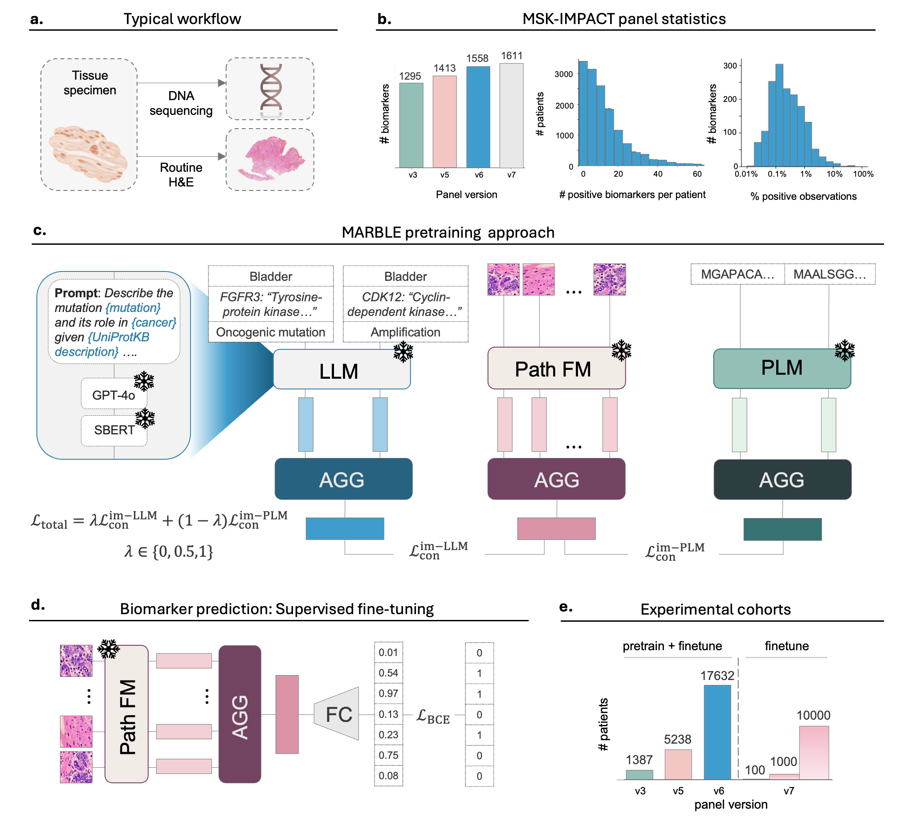

# MARBLE: Multimodal Alignment foR Biomarker Learning and gEneralization

Official code for the paper:

> **Multimodal Alignment Improves Generalizability of Genomic Biomarker Prediction in Computational Pathology**
>
> Ekaterina Redekop, Eric Zimmermann, Ava P Amini, Alex X Lu, Neil Tenenholtz, James Hall, Lorin Crawford, Kristen A Severson
>
> Microsoft Research, Cambridge, MA

MARBLE is a multimodal contrastive pretraining strategy that aligns histopathology image representations with genomic biomarker representations derived from a large language model (LLM) and a protein language model (PLM). This alignment enables data-efficient generalization to novel, out-of-distribution biomarkers.

## Overview



MARBLE consists of two stages:

1. **Contrastive Pretraining**: Aggregated histopathology embeddings (from a frozen pathology foundation model Virchow2) are aligned with aggregated biomarker embeddings derived from a frozen LLM (GPT-4o + Sentence-BERT) and/or a frozen PLM (ESM-2) via contrastive learning.
2. **Supervised Fine-tuning**: The image-only aggregator (initialized from pretraining) is fine-tuned with a multi-label classification head to predict biomarker status.

## Repository Structure

```
MARBLE/
├── README.md
├── requirements.txt
├── configs/                        # Example configuration files
│   ├── pretrain_llm.yaml           # MARBLE-LLM pretraining (Scenario 1)
│   ├── pretrain_plm.yaml           # MARBLE-PLM pretraining (Scenario 2)
│   ├── pretrain_llm_plm.yaml       # MARBLE joint pretraining (Scenario 3)
│   └── finetune.yaml               # Supervised fine-tuning
├── embeddings/                     # Biomarker embedding generation
│   ├── generate_llm_embeddings.py  # GPT-4o → SBERT pipeline
│   ├── generate_plm_embeddings.py  # Mutated protein → ESM-2 pipeline
│   └── protein_editing.py          # HGVS protein sequence editing utilities
├── marble/                         # Core model code
│   ├── model.py                    # MARBLE model variants
│   ├── modules.py                  # Projection head
│   ├── aggregator.py               # Agata tile aggregator
│   ├── loss.py                     # Contrastive and BCE losses
│   ├── dataset.py                  # Dataset classes for pretraining and fine-tuning
│   └── utils.py                    # Utilities (seed, checkpointing, metrics)
├── train_pretrain.py               # Contrastive pretraining (MARBLE-LLM, λ=1)
├── train_pretrain_plm.py           # Contrastive pretraining (MARBLE-PLM, λ=0)
├── train_pretrain_llm_plm.py       # Contrastive pretraining (MARBLE, λ=0.5)
└── train_finetune.py               # Supervised fine-tuning
```

## Setup

### Requirements

- Python ≥ 3.9
- PyTorch ≥ 2.0
- CUDA-capable GPU(s)

```bash
pip install -r requirements.txt
```

### Data Preparation

This codebase was developed using the [MSK-IMPACT](https://www.mskcc.org/msk-impact) cohort. To use your own data, you will need:

1. **Tile embeddings**: Pre-extracted tile-level embeddings from a pathology foundation model (e.g., [Virchow2](https://arxiv.org/abs/2408.00738)).
2. **Biomarker labels**: A parquet file with patient-level biomarker labels and metadata.
3. **Biomarker embeddings** (for pretraining):
   - **LLM-based**: Generate text descriptions of biomarkers using GPT-4o, then embed with Sentence-BERT (see Step 1 below).
   - **PLM-based**: Construct mutated protein sequences and embed with ESM-2 (see Step 2 below).

## Usage

### Step 1: Generate LLM-based Biomarker Embeddings

For each biomarker (gene + mutation + cancer type), we prompt GPT-4o to produce a concise description, then embed it with Sentence-BERT.

```bash
python embeddings/generate_llm_embeddings.py \
    --descriptions_pkl /path/to/llm_descriptions.pkl \
    --output_pkl /path/to/llm_sbert_embeddings.pkl
```

The input `descriptions_pkl` should be a dictionary `{sample_id: [list of text descriptions]}` generated by prompting GPT-4o with the template shown in the paper (Fig. S1).

### Step 2: Generate PLM-based Biomarker Embeddings

Construct mutated amino acid sequences from HGVS annotations and embed them with ESM-2.

```bash
# Step 2a: Generate mutated protein sequences from mutation data
python embeddings/generate_plm_embeddings.py \
    --mutations_file /path/to/data_mutations.txt \
    --output_npy /path/to/esm2_embeddings.npy
```

### Step 3: Contrastive Pretraining

**MARBLE-LLM** (Scenario 1: LLM-only alignment, using panels v3+v5+v6):

```bash
torchrun --nproc_per_node=4 train_pretrain.py \
    --config configs/pretrain_llm.yaml
```

**MARBLE-PLM** (Scenario 2: PLM-only alignment, using panels v3+v5):

```bash
torchrun --nproc_per_node=4 train_pretrain_plm.py \
    --config configs/pretrain_plm.yaml
```

**MARBLE** (Scenario 3: Joint LLM+PLM alignment, using panels v3+v5):

```bash
torchrun --nproc_per_node=4 train_pretrain_llm_plm.py \
    --config configs/pretrain_llm_plm.yaml
```

### Step 4: Supervised Fine-tuning

Fine-tune the pretrained image aggregator for multi-label biomarker classification:

```bash
torchrun --nproc_per_node=4 train_finetune.py \
    --config configs/finetune.yaml
```

Set `model.pretrained_checkpoint` in the config to the path of your pretrained MARBLE checkpoint. For the supervised baseline, leave this field empty.

## Configuration

All experiments are configured via YAML files. Key parameters:

| Parameter | Description |
|---|---|
| `dataset.path_to_bags` | Directory containing `.asdf` tile embedding files |
| `dataset.train_parquet` | Parquet file with training metadata and labels |
| `dataset.panel_label_mapping` | CSV mapping biomarker indices to descriptions |
| `training.batch_size` | Global batch size |
| `training.lr` | Learning rate |
| `training.weight_decay` | Weight decay |
| `training.num_epochs` | Max epochs |
| `model.in_features` | Tile embedding dimension (1280 for Virchow2) |
| `model.n_attention_queries` | Number of Agata attention queries |

## Model Variants

| Variant | λ | Description |
|---|---|---|
| MARBLE-LLM | 1.0 | Alignment with LLM embeddings only |
| MARBLE-PLM | 0.0 | Alignment with PLM embeddings only |
| MARBLE | 0.5 | Joint alignment with both modalities |

The total contrastive loss is: `L_total = λ · L_con^{im-LLM} + (1-λ) · L_con^{im-PLM}`

## Citation

```bibtex
@article{redekop2026marble,
  title={Multimodal Alignment Improves Generalizability of Genomic Biomarker Prediction in Computational Pathology},
  author={Redekop, Ekaterina and Zimmermann, Eric and Amini, Ava P and Lu, Alex X and Tenenholtz, Neil and Hall, James Brian and Crawford, Lorin and Severson, Kristen A},
  journal={arXiv preprint arXiv:2603.00193},
  year={2026}
}
```

## License

This project is released under the MIT License.
